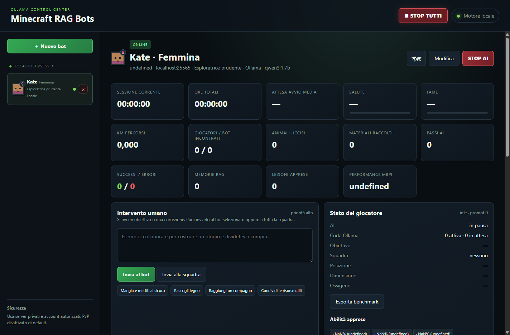
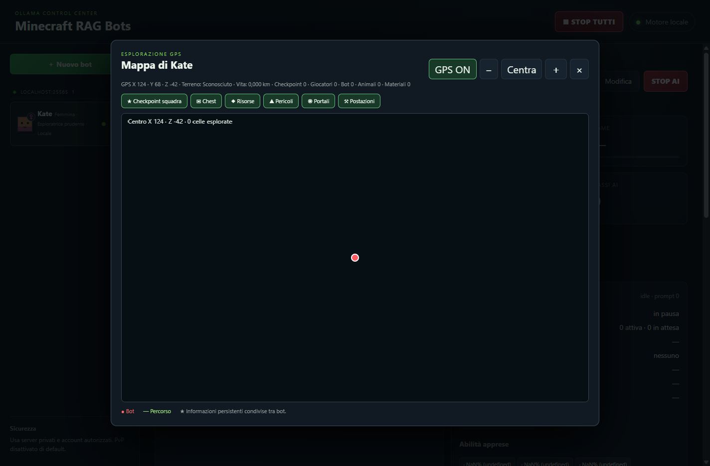
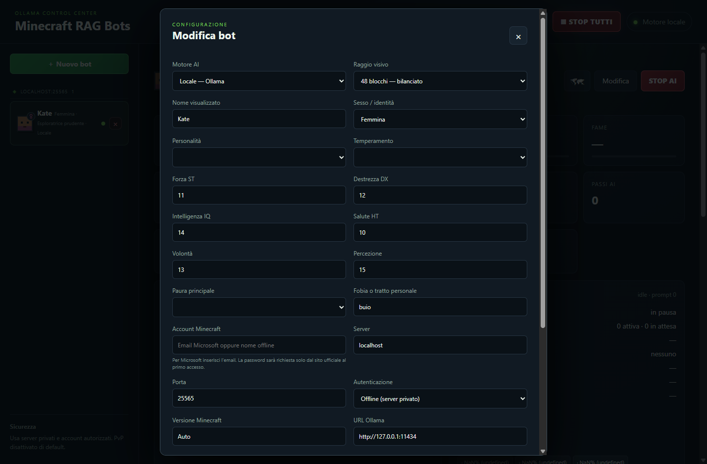

# Minecraft RAG Bots — Manuale d’uso

Versione di riferimento: **0.19.54**

## Download beta

Pagina release: https://github.com/bdbais/minecraft-rag-bots-beta/releases/latest

Installer Windows diretto: https://github.com/bdbais/minecraft-rag-bots-beta/releases/latest/download/Minecraft-RAG-Bots-0.19.54-Windows-Setup-x64.exe

Sorgenti e changelog sono allegati nella stessa pagina. Per segnalare un problema includere versione, sistema operativo, modello AI, log tecnico esportato e passi per riprodurlo.

Minecraft RAG Bots permette di gestire più bot Minecraft Java, con memoria persistente (RAG), chat, mappe, crafting, collaborazione tra bot e una biografia degli eventi. Il manuale descrive l’uso quotidiano dell’applicazione; non è necessario conoscere il codice.

## 1. Prima di iniziare

Servono:

- Minecraft Java Edition e un server raggiungibile (consigliato un server privato di test).
- Un account autorizzato sul server. Per server online-mode usare l’autenticazione Microsoft; non condividere la password.
- Ollama locale, se si sceglie un modello locale. L’app può verificarne lo stato e guidare l’installazione dei modelli.
- Risorse sufficienti per il numero di bot: su portatili leggeri iniziare con un solo bot e un modello piccolo.

Per un’installazione da sorgente: installare Node.js LTS, eseguire `npm install`, poi `npm start`. L’installer Windows include l’avvio dell’applicazione; dopo l’installazione aprire **Help → About** per verificare la versione.

Per i beta tester: usare un mondo/server di prova, fare un backup della cartella dati prima di aggiornare e iniziare con un solo bot. L’app non invia credenziali nei report.

## 2. Primo avvio e Ollama

All’avvio controllare il pannello di stato Ollama. Deve risultare **in esecuzione**, con il modello agente e il modello embedding disponibili. Se Ollama non è installato, usare il pulsante di installazione proposto oppure installarlo dal sito ufficiale e riaprire l’app.

Per provider cloud inserire la API key nella configurazione del bot. La dashboard mostra token usati, costo del provider attivo e stime equivalenti ChatGPT, Claude, Kimi e offline. I prezzi e il consumo elettrico sono stime: verificare sempre il listino del proprio account.

## 3. Creare e gestire i bot

Usare **Nuovo bot** per configurare server, username, modello, personalità e profilo psicofisico. In elenco, l’icona **⧉** clona direttamente un bot; nella dashboard è disponibile anche **Clona bot**. La copia crea una nuova identità e non trasferisce memoria privata, biografia o API key.

Il pulsante **START AI** connette automaticamente il bot se necessario; diventa **STOP AI** e arresta/disconnette il bot. Con più bot usare un modello leggero e aumentare l’intervallo decisionale per evitare timeout.

## 4. Memoria e apprendimento

Ogni bot mantiene biografia, lezioni, relazioni e ricordi separati. Le lezioni riuscite e verificate vengono anche raccolte nella memoria condivisa `shared-skills.json`: i nuovi bot le ricevono come skill comuni, senza ereditare personalità o traumi. Esportare periodicamente biografia e report tecnico.

## 5. Mappa, inventario e collaborazione

Aprire 🗺 per vedere il mondo esplorato; usare rotellina per zoom, GPS per seguire il bot e i filtri POI per evidenziare luoghi. I checkpoint di squadra condividono coordinate, chest, pericoli e risorse. Inventario, barra rapida, crafting, chest e ricette mostrano tooltip passando con il mouse.

## 6. Diagnosi rapida

- **Bootstrap non pronto**: verificare Ollama/modelli e leggere Attività tecniche.
- **Bot fermo**: premere STOP AI, controllare il log, poi START AI; il watchdog interrompe azioni senza progresso.
- **Crafting fallisce**: verificare legno/materiali, banco accessibile e inventario; usare un prompt esplicito come “raccogli legna, crafta un banco e posizionalo”.
- **Costo cloud inatteso**: controllare token e prezzi nella dashboard, poi fermare il bot o passare a un modello locale.

Modelli consigliati:

- computer poco potente: modello locale piccolo (per esempio `qwen3:1.7b` o quello indicato dal test hardware);
- computer più potente: modello locale più grande;
- modello cloud: compilare endpoint e API key nella scheda del bot.

Il modello embedding serve a cercare ricordi, ricette, luoghi e lezioni nella memoria RAG. Se lo stato è rosso, il bot può connettersi ma non pianificherà correttamente.

## 3. Creare e configurare un bot

Premere **＋ Nuovo bot**. Nella scheda compilare almeno:

1. nome, sesso e personalità;
2. server, host e porta (normalmente `25565`);
3. autenticazione (`Offline` per server privati offline-mode, `Microsoft` per server ufficiali online-mode);
4. modello locale o cloud;
5. raggio di visione, intervallo tra i cicli e timeout.

Per il primo test usare 48 blocchi di visione, un intervallo non aggressivo e timeout di piano/azione di almeno 30–60 secondi. I tratti GURPS (forza, destrezza, intelligenza, vitalità, volontà, percezione, paura e fobia) influenzano prudenza, esplorazione e collaborazione.

Nella parte bassa della finestra sono disponibili due azioni distinte:

- **Salva modifiche**: salva la configurazione senza cambiare la connessione;
- **Connetti/Disconnetti**: entra o esce dal server.

## 4. Avviare, fermare e impartire ordini

Nel cruscotto il pulsante **START AI** avvia l’AI e, se necessario, connette automaticamente il bot. Diventa **STOP AI** quando il comportamento autonomo è attivo; premendolo il bot viene fermato e disconnesso secondo lo stato mostrato.

La chat dell’app invia prompt al bot. Scrivere ordini concreti, ad esempio: “raccogli legno, crea un banco di lavoro e costruisci un’ascia”. Il bot usa osservazione, ricette, memoria RAG e inventario per trasformare l’ordine in azioni. Con `listenChat` attivo interpreta anche la chat Minecraft.

Se più bot sono nello stesso server e abbastanza vicini, possono scambiarsi informazioni e checkpoint: risorse, chest, miniere, dungeon, pericoli e postazioni di lavoro restano nella conoscenza condivisa.

## 5. Leggere il cruscotto

Le schede superiori mostrano:

- tempo della sessione e **ore totali** di vita online;
- attesa media di avvio, salute e fame;
- chilometri percorsi, giocatori/bot incontrati, animali uccisi e materiali raccolti;
- passi AI, successi/errori, memorie RAG, lezioni apprese e indice MBPI.

Lo stato giocatore mostra dimensione, coordinate, meteo, equipaggiamento, abilità e attività tecnica. Le ore totali sono persistenti e non si azzerano quando si chiude l’app.

### Barra rapida, oggetto in mano e inventario

La sezione **Oggetto selezionato** indica ciò che il bot tiene in mano. **Barra rapida** visualizza i nove slot in stile Minecraft; lo slot evidenziato è quello scelto dal bot. Sotto sono disponibili inventario, chest scoperte e ultimo contenuto conosciuto.

### Crafting

La finestra di crafting mostra le ricette conosciute e il grafico degli ingredienti. Il bot dovrebbe seguire la progressione base: tronchi → assi → banco di lavoro → bastoni/utensili → chest/letto. Se una ricetta non è disponibile, verificare prima materiali, spazio nell’inventario, banco vicino e permessi del server.

## 6. Mappa, conoscenza e checkpoint

Premere l’icona 🗺 per aprire la mappa GPS. Con **GPS ON** la posizione resta centrata mentre il bot si muove. I filtri evidenziano checkpoint di squadra, chest, risorse, pericoli, portali e postazioni. La traccia del percorso e i punti di interesse vengono salvati nella conoscenza del mondo.

Le finestre **Conoscenza del mondo** e **Checkpoint di squadra** sono scrollabili. La prima contiene osservazioni persistenti (bioma, blocchi, ricette, meteo, luoghi); la seconda contiene informazioni utili agli altri bot.

## 7. Memoria, biografia ed export

Ogni evento importante entra nella biografia: avvio, viaggio, meteo, chat, raccolta, crafting, errori e lezioni. La memoria RAG conserva sia successi sia fallimenti; dopo un errore il bot può evitare lo stesso piano quando dispone di materiali o contesto migliori.

Dal menu **File** esportare:

- il singolo bot con configurazione, memoria e cronologia;
- tutta la configurazione;
- il log tecnico o il benchmark MBPI.

La biografia può essere esportata e usata per generare un libro epico che unisce le gesta del bot alla storia del mondo. Conservare gli export come backup prima di reinstallare.

## 8. Troubleshooting rapido

**“Bootstrap non pronto” o JSON non valido** — fermare il bot, chiudere l’app, riaprirla e controllare che il file di configurazione sia JSON valido. Se il problema persiste, esportare il log tecnico e ripristinare l’ultimo backup.

**Il bot resta fermo o va in timeout** — controllare Ollama, ridurre il modello, aumentare i timeout, ridurre il raggio di visione e avviare un solo bot. Verificare che il server risponda e che il bot non sia in pausa.

**Non raccoglie legno/terra/roccia** — controllare che il bot sia connesso, che l’ordine sia in chat, che il blocco sia raggiungibile e che l’inventario non sia pieno. Per il crafting base servono tronchi: chiedere prima “trova alberi, raccogli tronchi e verifica l’inventario”.

**Non crea banco, chest o ascia** — verificare la ricetta mostrata nella finestra Crafting, i materiali e la presenza di un banco. Se la ricetta è nuova, attendere il messaggio di apprendimento; poi ripetere l’ordine con un obiettivo alla volta.

**La chat non viene letta** — nella configurazione attivare `listenChat`, salvare e riconnettere il bot. Controllare nel log tecnico l’evento di ricezione chat.

**Il computer rallenta con 3–4 bot** — usare modelli piccoli, aumentare l’intervallo decisionale, ridurre la visione e fermare i bot inattivi. Il pulsante STOP AI resta disponibile anche quando un ciclo AI è lento; se la UI non risponde, usare il comando di chiusura dell’app e riavviare.

## 9. Sicurezza e privacy

Usare server propri o con autorizzazione. Le credenziali Microsoft non devono essere inserite nei log o condivise. Le API key cloud vanno conservate solo nella configurazione locale e revocate se il file viene copiato. Prima di pubblicare un export, rimuovere host privati, username, coordinate sensibili e chiavi.

## 10. Checklist consigliata

1. Avviare Ollama e verificare modello agente + embedding.
2. Creare un bot e salvare la configurazione.
3. Connettere il bot a un server di test.
4. Controllare chat, salute, fame e coordinate.
5. Ordinare raccolta tronchi e verificare la barra rapida/inventario.
6. Creare banco, chest e primo utensile.
7. Esplorare la mappa e verificare checkpoint condivisi.
8. Esportare log, benchmark e biografia.

## Screenshot

